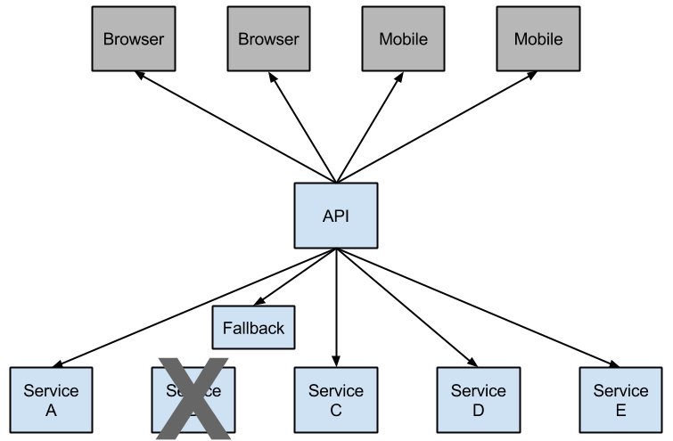
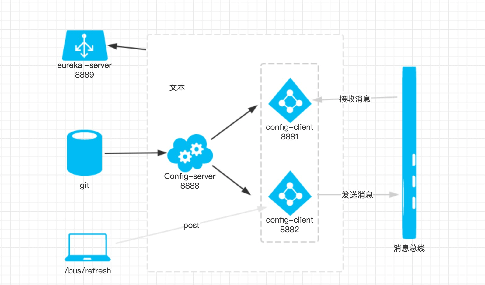

#### ribbon 
1. spring cloud 两种服务调用方式
- ribbon + restTemplate
- feign

2. ribbon是一个负载均衡客户端，可以很好的控制htt和tcp的一些行为,ribbon 已经默认实现了这些配置bean
- IClientConfig ribbonClientConfig: DefaultClientConfigImpl
- IRule ribbonRule: ZoneAvoidanceRule
- IPing ribbonPing: NoOpPing
- ServerList ribbonServerList: ConfigurationBasedServerList
- ServerListFilter ribbonServerListFilter: ZonePreferenceServerListFilter
- ILoadBalancer ribbonLoadBalancer: ZoneAwareLoadBalancer

3. @LoadBalanced注解表明这个restTemplate开启负载均衡的功能,在浏览器上多次访问http://localhost:8674/hi?name=forezp，
浏览器交替显示：hi forezp,i am from port:8762 / hi forezp,i am from port:8763 （service-hi 启动多个实例）


#### feign 
1. Feign简介
> feign 是一个声明式的伪 http 客户端，它使得写 http 客户端变得简单，使用 feign，只需要创建一个接口并注解。它具有可插拔的注解特性，
>可以使用 feign 注解和 JAX-RS 注解。feign 支持可插拔编码器和解码器。feign 默认集成了 ribbon,并和 eureka 结合，默认实现了负载均衡效果

- Feign 采用的是基于接口的注解
- Feign 整合了ribbon，具有负载均衡的能力
- 整合了Hystrix，具有熔断的能力

2. 测试功能
> 在浏览器上多次访问http://localhost:8674/hi?name=forezp， 
> 浏览器交替显示：hi forezp,i am from port:8762 / hi forezp,i am from port:8763 （service-hi 启动多个实例）

####  hystrix
1. 断路器
> 在微服务架构中，根据业务拆分成一个个服务，服务与服务之间可以相互调用（rpc），在spring cloud 中可以通过 ribbon+restTemplate 和 feign 调用。
>为了保证高可用，单个服务通常会集群不熟。由于网络或者自身原因，服务并不能保证100%可用，如果单个服务出现问题，调用这个服务就会出现线程阻塞，
>此时如果有大量的请求涌入，servlet容器的线程资源会被消耗完毕，导致服务瘫痪。服务与服务之前的依赖性，故障会传播，会对整个微服务系统造成灾难性的后果，
>这就是服务器的“雪崩”效应

> 当对特定的服务的调用的不可用达到一个阀值（Hystrix 是5秒20次） 断路器将会被打开



2. ribbon 和 feign 熔断器
- ribbon参见（service-hystrix）  feign 参见（service-feign）
- feign是自带断路器的，在D版本的Spring Cloud之后，它没有默认打开。需要在配置文件中配置打开它 feign.hystrix.enabled=true
- ribbon指定断路方法；feign指定断路类，类实现被@FeignClient注解的接口

#### zuul
1. zuul 简介
> zuul的主要功能是路由转发与过滤。路由功能是微服务的一部分，比如/api/user转发到user服务，/api/shop转发到shop服务。
>zuul默认和Ribbon结合实现了负载均衡的功能。

2. 微服务治理组件
> 服务注册与发现，服务消费，负载均衡，断路器，智能路由，配置管理等等。客户端请求首先经过负载均衡（zuul，Ngnix）,再到服务网关（zuul集群），
>然后再到具体的服务。服务统一注册到高可用的服务注册中心集群，服务的所有的配置文件由配置服务管理，配置服务的配置文件放在git仓库


3. zuul包含功能
- Authentication
- Insights
- Stress Testing 
- Canary Testing 
- Dynamic Routing
- Service Migration
- Load Shedding 
- Security
- Static Response Handling
- Inactive/Active Traffic Management

4. 测试zuul
> 打开浏览器访问：http://localhost:8769/api-a/hi?name=forezp ;浏览器显示:hi forezp,i am from port:8762
> 打开浏览器访问：http://localhost:8769/api-b/hi?name=forezp ;浏览器显示：hi forezp,i am from port:8762
> 过滤功能见 MyFilter

#### config server 
1. 简介
> 方便服务配置文件统一管理，实时更新。分布式配置中心组件spring cloud config ，它支持配置服务放在配置服务的内存中（即本地），也支持放在远程Git仓库中

2. http请求地址和资源文件映射
- {application}/{profile}/{label}
- {application}-{profile}.yml
- /{label}/{application}-{profile}.yml
- /{application}-{profile}.properties
- /{label}/{application}-{profile}.properties

3. config server 测试
> 远程仓库中有个文件config-client-dev.properties文件中有一个属性：foo = foo version 3.
> 启动程序：访问 http://localhost:8888/config-client/dev/master
```json
{
    "name":"config-client",
    "profiles":[
        "dev"],
    "label":"master",
    "version":"4988d99ed29b906cae6c7fb7ba7a02a41fe4d13e",
    "state":null,
    "propertySources":[
        {
            "name":"https://github.com/ZhangMing520/spring-cloud-code//respo/config-client-dev.properties",
            "source":{
                "foo":"foo version 3"
            }
        }]
}
```

4. config client使用config server 
> properties配置之后，直接 @Value 可以注入属性值


5. 高可用的分布式配置中心（“高可用分布式配置中心”指明修改内容）


#### Spring Cloud Bus
1. 简介
> 将分布式的节点用轻量的消息代理连接起来，她可以用于广播配置文件的更改或者服务之间的通讯，也可以用于监控。
[rabbitmq安装](https://www.rabbitmq.com/)

2. 测试 spring cloud bus
> 依次启动eureka-server、config-server,config-client，访问http://localhost:8881/hi 浏览器显示：foo version 3，
>这时我们去代码仓库将foo的值改为“foo version 4”，即改变配置文件foo的值。传统的做法，需要重启服务，才能达到配置文件的更新。
>此时，我们只需要发送post请求：http://localhost:8881/actuator/bus-refresh，你会发现config-client会重新读取配置文件。
> 这时我们再访问http://localhost:8881/hi 浏览器显示：foo version 4。

> 另外，/actuator/bus-refresh接口可以指定服务，即使用”destination”参数，
> 比如 “/actuator/bus-refresh?destination=config-client:**” 即刷新服务名为 config-client 的所有服务

- curl -X POST http://localhost:8882/actuator/bus-refresh / curl -X POST http://localhost:8882/actuator/bus-refresh?destination=config-client
- @RefreshScope 需要用在需要刷新的地方（需要获取最新的值等），而不是Application类上

3. 消息架构图
> 当git文件更改的时候，通过pc端用post 向端口为8882的config-client发送请求/bus/refresh／；
>此时8882端口会发送一个消息，由消息总线向其他服务传递，从而使整个微服务集群都达到更新配置文件。


#### Spring Cloud Sleuth
1. 简介
> 服务跟踪组件zipkin,spring cloud sleuth集成了zipkin组件。微服务架构上通过业务来划分服务，通过rest调用，对外暴露的一个接口，
>可能需要很多个服务协同才能完成这个接口功能，如果链路上任何一个服务出现问题或者网络超时，都会导致接口调用失败。


２. 术语
- span：基本工作单元，例如：在一个新建的span中发送一个rpc等同于发送一个回应请求给rpc，span通过一个64位id唯一标识，trace以另一个64位id标识，
span还有其他数据信息，比如摘要、时间戳时间、关键值诸注释（tags）、span的id、以及进度id（通常是ip地址）span在不断的启动和停止，同时记录了时间信息，
当你创建了一个span，你必须在未来的某个时刻停止它
- trace：一些列spans组成的一个树状结构，例如：如果你正在跑一个分布式大数据工程，你可能需要创建一个trace
- annotation：用来及时记录一个事件的存在，一些核心annotations用来定义一个请求的开始和结束
    - cs：client sent 客户端发送一个请求，这个annotation描述了这个span的开始
    - sr：server received 服务端获得请求并准备开始处理它，如果将其sr减去cs时间戳便可得到网络延迟
    - ss：server sent 注解表明请求处理的完成（当请求返回客户端），如果ss减去sr时间戳便可得到服务端需要的处理请求时间
    - cr：client received 表明span的结束，客户端成功接收到服务端的回复，如果cr减去cs时间戳便可得到客户端从服务端获取回复的所需时间


3. 测试
> 三个工程组成：server-zipkin：主要作用是使用ZipkinServer的功能，收集调用数据并展示；一个service-zipkin-hi，一个service-zipkin-miya,
>这两个service相互调用；只有相互调用了（没有相互调用的收集），server-zipkin才会收集数据的。


> spring Cloud为F版本的时候，已经不需要自己构建Zipkin Server了,[只需要下载jar即可](https://dl.bintray.com/openzipkin/maven/io/zipkin/java/zipkin-server/)
> java -jar zipkin-server-2.10.1-exec.jar，访问浏览器localhost:9411

> 浏览器访问：http://localhost:8989/hi


#### 高可用配置中心
1. 如何配置
> you could use this configuration to test the peer awareness on a single host (there’s not much value in doing that in production) 
> by manipulating /etc/hosts to resolve the host names.
> 按照官方文档的指示，需要改变etc/hosts，linux系统通过vim /etc/hosts ,加上： 127.0.0.1 peer1 127.0.0.1 peer2


2. 测试
>java -jar eureka-server-0.0.1-SNAPSHOT.jar - -spring.profiles.active=peer1/java -jar eureka-server-0.0.1-SNAPSHOT.jar - -spring.profiles.active=peer2
> 打开浏览器发现注册了service-hi，并且有个peer2节点，同理访问localhost:8769你会发现有个peer1节点,client只向8761注册，但是你打开8769，你也会发现，8769也有 client的注册信息

> In some cases, it is preferable for Eureka to advertise the IP Addresses of services rather than the hostname. 
>Set eureka.instance.preferIpAddress to true and when the application registers with eureka, it will use its IP Address rather than its hostname.
> eureka.instance.preferIpAddress=true是通过设置ip让eureka让其他服务注册它。也许能通过改变host的方式。

> Eureka-eserver peer1 8761,Eureka-server peer2 8769相互感应，当有服务注册时，两个Eureka-server是对等的，
>它们都存有相同的信息，这就是通过服务器的冗余来增加可靠性，当有一台服务器宕机了，服务并不会终止，因为另一台服务存有相同的数据


#### 注意
1. 错误: 找不到或无法加载主类 com.example.eurekaclient.EurekaClientApplication
```sh 
Maven > Lifecycle > clean
Maven > Lifecycle > compile
```

2. eureka client:Cannot execute request on any known server
- 认真核对 server 地址和端口，一定要对上 
- default-zone 修改为 defaultZone

3. 配置说明
- fetch-registry=false  register-with-eureka=false 表明自己是一个 server
- eureka.client.service-url 服务端设置服务地址，客户端获取服务的地址