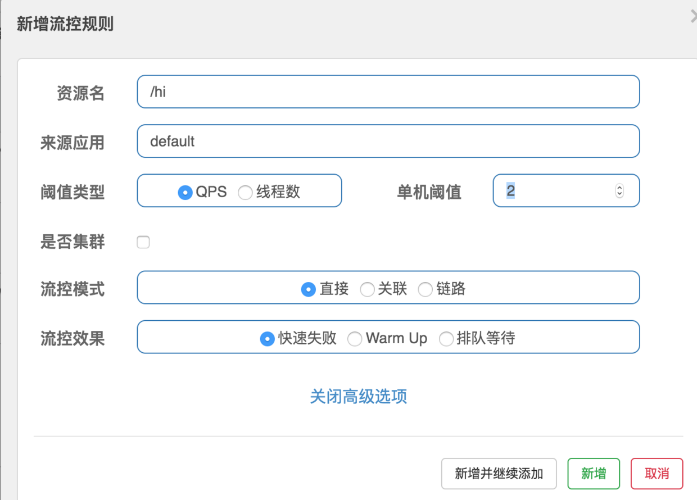

#### nacos 
1. 简介
> nacos 致力于帮助您发现，配置和管理微服务。nacos提供了一组简单易用的特性集，帮助您快速的实现动态服务发现、
>服务配置、服务元数据和流量管理。类似Consul、Eureka，同时又提供了分布式配置中心的功能，支持热加载。
>目前主流的服务注册和发现组件有Consul、Eureka、Etcd等

- 服务发现和服务健康监控
- 动态配置服务，带管理界面，支持丰富的配置维度
- 动态DNS服务
- 服务及其元数据管理
[下载地址](https://github.com/alibaba/nacos/releases)
```bash
# nacos 启动之前需要配置 conf/application.properties，主要是数据配置（mysql）

# 启动命令
sh startup.sh -m standalone

# ubuntu 启动错误
./startup.sh: 78: ./startup.sh: [[: not found
./startup.sh: 88: ./startup.sh: [[: not found
./startup.sh: 90: ./startup.sh: [[: not found
./startup.sh: 96: ./startup.sh: [[: not found
/usr/lib/jvm/java-8-openjdk-amd64/bin/java  -server -Xms2g -Xmx2g -Xmn1g -XX:MetaspaceSize=128m -XX:MaxMetaspaceSize=320m -XX:-OmitStackTraceInFastThrow -XX:+HeapDumpOnOutOfMemoryError -XX:HeapDumpPath=/data/soft/nacos/logs/java_heapdump.hprof -XX:-UseLargePages -Djava.ext.dirs=/usr/lib/jvm/java-8-openjdk-amd64/jre/lib/ext:/usr/lib/jvm/java-8-openjdk-amd64/lib/ext:/data/soft/nacos/plugins/cmdb:/data/soft/nacos/plugins/mysql -Xloggc:/data/soft/nacos/logs/nacos_gc.log -verbose:gc -XX:+PrintGCDetails -XX:+PrintGCDateStamps -XX:+PrintGCTimeStamps -XX:+UseGCLogFileRotation -XX:NumberOfGCLogFiles=10 -XX:GCLogFileSize=100M -Dnacos.home=/data/soft/nacos -jar /data/soft/nacos/target/nacos-server.jar  --spring.config.location=classpath:/,classpath:/config/,file:./,file:./config/,file:/data/soft/nacos/conf/ --logging.config=/data/soft/nacos/conf/nacos-logback.xml
./startup.sh: 116: ./startup.sh: [[: not found
nacos is starting，you can check the /data/nacos/logs/start.out

# 使用以下命令启动
bash -f startup.sh -m standalone
```
[启动之后浏览器访问](http://localhost:8848/nacos)


#### sentinel 
1. 简介
> 哨兵，为微服务提供流量控制，熔断降级的功能，和Hystrix提供的功能一样，可以有效的解决微服务调用产生的“雪崩”效应，
>为微服务系统提供了稳定性的解决方法。通常情况，Hystrix采用线程池对服务的调用进行隔离，sentinel采用了用户线程对接口进行隔离，二者进行对比，
>Hystrix是服务级别的隔离，sentinel提供了接口级别的隔离，sentinel隔离级别更加精细，另外sentinel直接使用用户线程进行限制，相对Hystrix的线程池隔离，
>减少线程切换的开销。另外sentinel的dashboard提供了在线更改限流规则的配置，也更加的优化

[sentinel dashboard下载地址](https://github.com/alibaba/Sentinel/releases)
```bash 
java -jar sentinel-dashboard-1.6.1.jar
```


2. 测试
> 多次快速访问nacos-provider的接口资源http://localhost:8762/hi，可以发现偶尔出现以下的信息:
> Blocked by Sentinel (flow limiting)

3. FeignClient中使用Sentinel
> 被限流的时候FeignClient并不会调用nacos-provider的接口，而是在nacos-consumer工程里直接报错
```xml
<dependencies>
    <dependency>
        <groupId>org.springframework.cloud</groupId>
        <artifactId>spring-cloud-starter-openfeign</artifactId>
    </dependency>
    <dependency>
        <groupId>org.springframework.cloud</groupId>
        <artifactId>spring-cloud-starter-alibaba-sentinel</artifactId>
        <version>0.9.0.RELEASE</version>
    </dependency>
</dependencies>
```
```properties
feign.sentinel.enabled: true
```